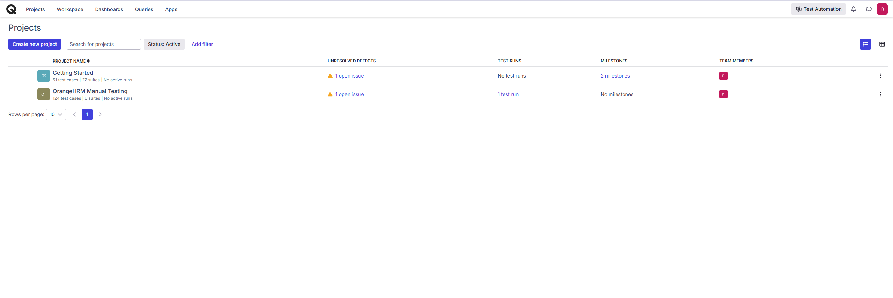
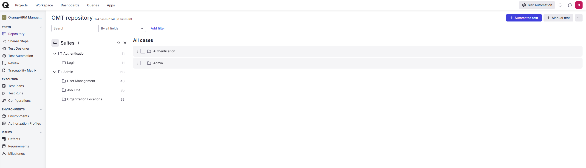
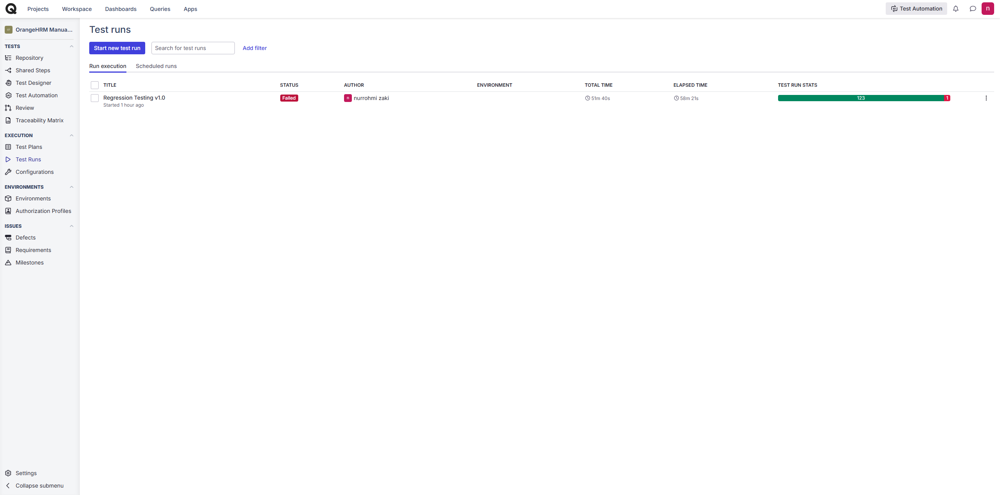
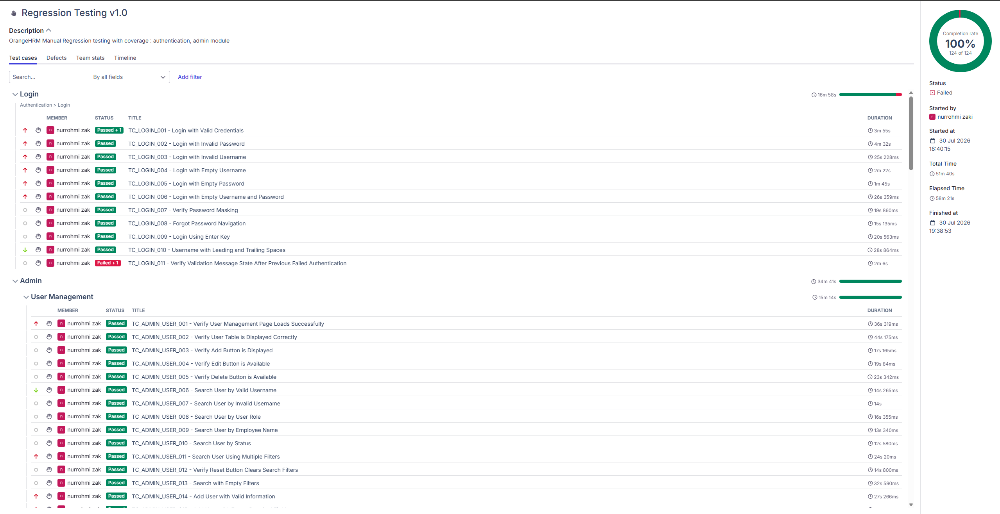

# QA Portfolio

A collection of Quality Assurance projects demonstrating structured manual testing, professional QA documentation, test execution, defect reporting, and industry-standard testing workflows.

This portfolio showcases my end-to-end Software Testing Life Cycle (STLC), from application analysis and test planning to execution, bug reporting, evidence collection, and test management using Qase.io.

---

# About Me

Hi, I'm **Nurrohmi Zaki**.

I'm a Software Engineer transitioning into Quality Assurance with a strong interest in Software Testing, Test Automation, and Quality Engineering.

I enjoy analyzing software behavior, designing structured test cases, identifying defects, and improving software quality through systematic testing practices.

Current areas of focus:

- Manual Testing
- Test Documentation
- Exploratory Testing
- Bug Reporting
- API Testing
- Test Automation

---

# Portfolio Highlights

- OrangeHRM Manual Testing Project
- 4 Completed Modules
- 124 Manual Test Cases
- 124 Test Executions
- 123 Passed • 1 Failed
- 99.19% Pass Rate
- 1 Confirmed Defect
- Complete STLC Documentation
- Qase.io Test Management
- Professional QA Documentation

---

# Repository Statistics

| Metric | Value |
|---------|------:|
| Applications | 1 |
| Modules Tested | 4 |
| Test Suites | 4 |
| Test Cases | 124 |
| Test Executions | 124 |
| Passed | 123 |
| Failed | 1 |
| Pass Rate | 99.19% |
| Bug Reports | 1 |

---

# Project Status

Status: **Completed**

This repository represents a completed Manual Testing portfolio project.

Future QA projects (API Testing, Automation Testing, SQL Testing, etc.) will be developed in separate repositories to keep each portfolio focused on a specific testing discipline.

---

# Repository Structure

```text
QA-Portfolio
│
├── docs
│   ├── 01-project-overview.md
│   └── 02-application-analysis.md
│
├── manual-testing
│   ├── 01-test-plans
│   ├── 02-test-scenarios
│   ├── 03-test-cases
│   ├── 04-test-executions
│   ├── 05-bug-reports
│   ├── 06-test-summary-reports
│   └── evidence
│
├── Qase
│   ├── README.md
│   ├── test-suites.md
│   ├── test-runs.md
│   ├── test-metrics.md
│   └── screenshots
│
├── CHANGELOG.md
└── README.md
```

---

# QA Workflow

The project follows the complete Software Testing Life Cycle (STLC).

```text
Requirement Analysis
        ↓
Application Analysis
        ↓
Test Planning
        ↓
Test Scenario Design
        ↓
Test Case Design
        ↓
Qase Test Management
        ↓
Manual Test Execution
        ↓
Evidence Collection
        ↓
Bug Reporting
        ↓
Test Summary Report
```

---

# Completed Project

## OrangeHRM Demo

### Authentication

| Feature | Status |
|---------|--------|
| Login | Completed |

### Admin

| Feature | Status |
|---------|--------|
| User Management | Completed |
| Job Titles | Completed |
| Organization Locations | Completed |

---

# Testing Artifacts

This repository contains complete QA documentation including:

- Project Overview
- Application Analysis
- Test Plans
- Test Scenarios
- Test Cases
- Test Execution Reports
- Test Summary Reports
- Bug Reports
- Testing Evidence
- Qase Test Management Documentation

---

# Testing Techniques

The following techniques were applied throughout the project.

- Manual Testing
- Functional Testing
- Black Box Testing
- Exploratory Testing
- Equivalence Partitioning
- Boundary Value Analysis (BVA)
- Error Guessing
- Validation Testing
- UI Testing

---

# Tools

## Test Management

- Qase.io

## Documentation

- Markdown
- Git
- GitHub

## Browser

- Google Chrome
- Chrome DevTools

## Development

- Visual Studio Code

## Evidence Collection

- Windows Snipping Tool

---

# Qase Integration

This project uses **Qase.io** as the Test Management System to simulate an industry-standard QA workflow.

Activities managed through Qase include:

- Test Suite Management
- Test Case Management
- Test Run Management
- Manual Test Execution
- Test Result Tracking
- Execution Metrics

---

# Public Test Report

View the public execution report:

**Test Report**

https://app.qase.io/public/report/9c71f87df569b6ce48dfb60dfd6e4640dfe09788#test-cases

---

# Qase Screenshots

## Dashboard



Provides an overview of the testing project, including test suites, executions, and overall progress.

---

## Test Suites



Shows how test cases are organized by application modules.

---

## Test Run



Displays the manual execution process and execution status for each test case.

---

## Execution Summary



Displays execution metrics including Passed, Failed, Blocked, and overall Pass Rate.

---

# Repository Highlights

- Structured QA Documentation
- Complete STLC Implementation
- Manual Functional Testing
- Exploratory Testing
- Test Execution Tracking
- Evidence Collection
- Bug Reporting
- Qase Integration
- Industry-Standard Documentation

---

# Future QA Portfolio

The following repositories are planned to expand this portfolio:

- RESTful Booker API Testing
- API Test Automation (Postman & Newman)
- UI Test Automation (Playwright)
- SQL Testing Portfolio

---

# Goal

The purpose of this repository is to demonstrate practical manual testing skills using industry-standard QA documentation and workflows.

As additional QA projects are completed, this portfolio will continue to expand with separate repositories covering API Testing, Automation Testing, Database Testing, and other Quality Assurance disciplines.

---

# Contact

**Nurrohmi Zaki**

GitHub

https://github.com/siKic0l

LinkedIn

https://www.linkedin.com/in/nurrohmi-zaki-78b447294/
